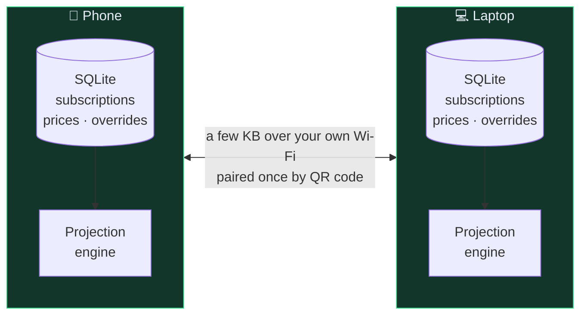
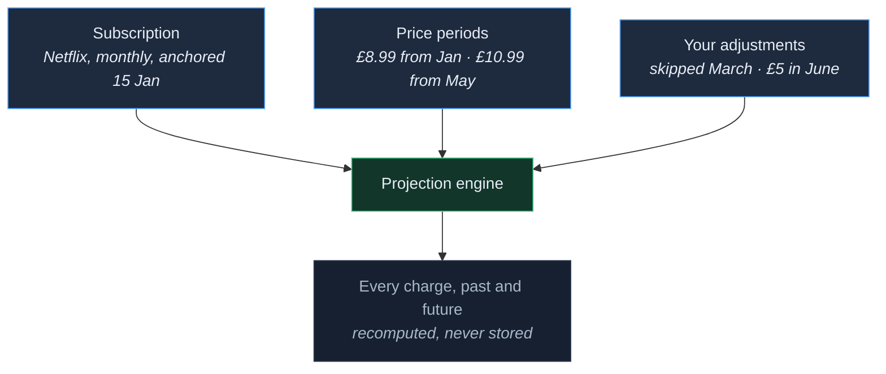
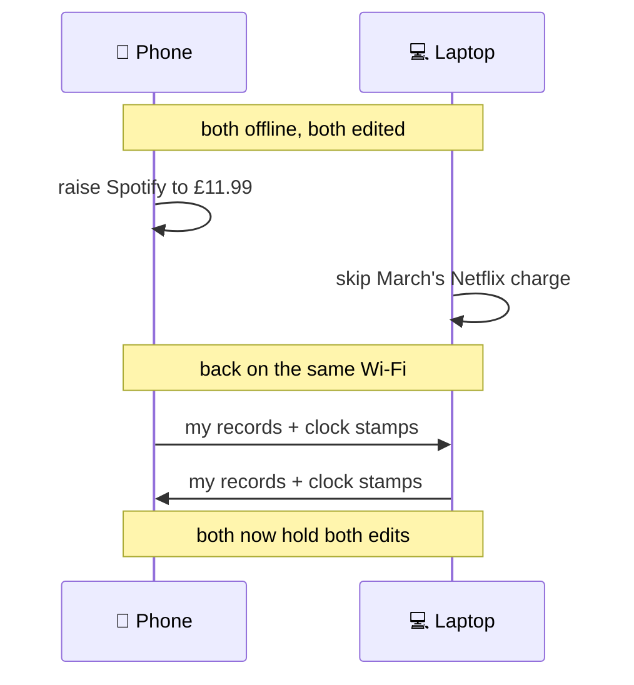

<div align="center">

# SubTracker

**Know what your subscriptions really cost — without handing your finances to anyone.**

[](../../actions/workflows/ci.yml)
[](LICENSE)
[](#installing-it)
[](#running-the-tests)

Android and Windows · no server · no account · no sign-up · no telemetry

</div>

---

## The short version

Subscription trackers usually want an account, your email, or read access to your bank. SubTracker
wants none of it. Everything lives on your own device, and if you have two devices they talk to
**each other** over your Wi-Fi — scan a QR code once and they stay in step. There is no middle.

It also tries hard to tell you the truth about money, which is subtler than it sounds. Most
trackers add up your monthly bills and call it a total. That answer is wrong in both directions:
it ignores the annual plan that renews in March, and it makes the month that annual plan lands in
look like a catastrophe. SubTracker keeps those two questions apart and answers both.

<!--
  SCREENSHOTS — drop PNGs into docs/screenshots/ and delete this comment block.

<div align="center">


</div>
-->

---

## What it does

| | |
| --- | --- |
| **Any billing cycle** | Weekly, monthly, quarterly, yearly — or any whole number of days, weeks, months or years. "Every 4 weeks" is not the same as monthly: it bills 13 times a year, and the app says so. |
| **Two totals, never merged** | *Cash flow* is what leaves your account this month. *Run rate* is what everything costs per month once annual plans are spread out. Adding them together is meaningless, so it never does. |
| **Honest price history** | A price rise doesn't rewrite the past. Each charge is valued at the price in force on its own due date, so "what did I pay last year" stays correct forever. |
| **Mixed currencies** | Each subscription keeps its own. Only totals convert, using ECB rates fetched automatically — or a rate you type, which is never overwritten. |
| **Renewal reminders** | From the device itself. Set one rule for everything, or a different one per subscription, or none. |
| **Trials that don't catch you out** | Flags a trial before it converts, while cancelling is still free. |
| **Skips, refunds, corrections** | Adjust an individual charge without distorting the schedule it came from. |
| **One-file backup** | A CSV that opens in a spreadsheet. Export, reinstall, import. |

---

## How the syncing works

Most apps sync through a server: your data leaves your device, sits on someone's machine, and
comes back. SubTracker has no middle at all.



Both devices hold the whole truth and compute everything locally. Either works alone, indefinitely,
with the other switched off or thrown in a river.

### Why the payload is tiny

Charges are never stored or sent. They are *derived* — a pure function of a subscription's schedule
and its price history — so each device recomputes them on demand:



Only the three boxes on the left ever travel. That is why a full sync is a few kilobytes no matter
how many years of history you have — and why the same data renders identically on a phone that has
never spoken to the other device.

### Two devices, one answer

Devices get edited while apart, so the merge has to be right rather than merely last-one-wins:



Each record carries a **hybrid logical clock** stamp rather than wall-clock time, because phones
and laptops disagree about what time it is — often by seconds, sometimes wildly. With plain
timestamps, an edit made later can carry an earlier time and silently lose. Merging is
commutative, associative and idempotent, so the devices converge to the same answer no matter what
order they sync in or how many times.

---

## Why it is built this way

The interesting parts of this project are the constraints. Each of these exists because the
obvious alternative fails in a way that looks completely ordinary on screen.

**Money is always an integer count of minor units.** No float ever touches an amount. Floats make
£10.99 + $23.76 quietly become "£34.75" — a number that is wrong and looks entirely normal.

**Dates are always plain `YYYY-MM-DD` text**, never a date/instant type. A billing date is a
calendar date, not a moment; give it a timezone and a subscription bills on the wrong day for
anyone who travels.

**Every occurrence is computed from the anchor date, never from the previous one.** Chaining looks
equivalent and isn't: a 31 January anchor goes 31 Jan → 28 Feb → 28 Mar → 28 Apr, and the schedule
is permanently corrupted after one month-end clamp. Anchored, it returns to the 31st in March and
to the 29th in leap years, for free.

**"Paid" is derived, never stored.** It is simply `due_date < today`, so history stays correctable
and a device that was switched off for a month doesn't need catching up.

**Deletes are tombstones.** During a merge, "absent" and "deleted" are indistinguishable — so a
hard delete gets resurrected by the other device's stale copy.

**Charge-override ids are derived, not random.** If both devices skip the same charge, they must
produce the *same* record for last-write-wins to settle it, rather than two rows both claiming one
charge.

**The projection engine exists twice** — JavaScript for the optional server, Kotlin for the device.
They are held together by a generated corpus of test vectors that *both* suites assert against, so
the two implementations cannot drift apart unnoticed.

The full design log, including the decisions that turned out to be wrong, is in **[PLAN.md](PLAN.md)**.

---

## Installing it

Download from **[Releases](../../releases)**.

**Android** — grab the `.apk` and open it. Android will ask you to allow installing from this
source, which is expected for anything not from the Play Store. Needs Android 8.0 or newer.

**Windows** — grab the portable `.zip`, extract anywhere, run `SubTracker.exe`. Nothing is
installed, nothing touches the registry, and deleting the folder removes it completely.

### Pairing two devices

1. Open **Devices** on both.
2. Tap **Add a device** on one — it shows a QR code.
3. Scan it with the other.

They must be on the same Wi-Fi. After that they sync whenever you open the app. The pairing code is
single-use and the shared secret never leaves the two devices.

---

## Building from source

Requires JDK 17+, plus the Android SDK for the Android app.

```bash
git clone https://github.com/mzmknight/subtracker.git
```

```bash
cd subtracker/apps && ./gradlew :desktopApp:run
```

The Android debug APK, the Windows installer, and the no-install portable zip:

```bash
./gradlew :androidApp:assembleDebug
```

```bash
./gradlew :desktopApp:packageMsi
```

```bash
./gradlew :desktopApp:packagePortable
```

Release signing is read from `signing/keystore.properties`, which is deliberately not in this
repository. Without it a release build simply comes out unsigned rather than failing, so a fresh
clone builds and runs with no key at all.

---

## Running the tests

**291 tests** across two suites, both run in CI on every push.

The shared Kotlin module — projection, money, dates, history, merge, peer sync, CSV round-trips,
and the local store exercised against a real in-memory SQLite rather than a fake:

```bash
cd apps && ./gradlew :shared:desktopTest
```

The JavaScript engine, plus the shared vector corpus that keeps it agreeing with the Kotlin one:

```bash
cd backend && npm test
```

---

## Project layout

| Path | What lives there |
| --- | --- |
| `apps/shared` | Nearly everything — models, projection, sync, and the Compose UI shared by both platforms |
| `apps/androidApp` | Android entry point, notifications, camera QR scanning |
| `apps/desktopApp` | Windows entry point, native file dialogs, packaging |
| `backend/engine` | Projection engine in plain JS, no PocketBase dependency |
| `backend/pb_hooks` | PocketBase hooks — generated from `engine/`, never hand-edited |
| `tools` | Icon generation |

Roughly 90% of the code, **including the entire UI**, is shared between Android and Windows via
Compose Multiplatform. The two app modules are thin entry points.

The [PocketBase backend](backend/README.md) is genuinely optional — it predates the peer-to-peer
sync and is kept for anyone who wants an always-on copy. The apps do not need it and never have.

---

## Licence

[MIT](LICENSE) — do what you like with it.
